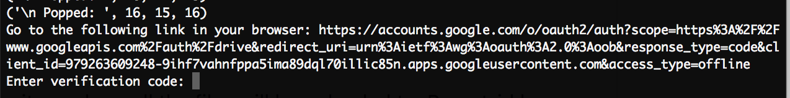

# CSV Loader
Bash Script to help automate and sort CSV entries into Google Drive.

# Prerequisites

Python >2.7 must be installed on the system to function. You must also have permission to run bash scripts

# Installation

### Clone or download the git repo
```
$ git clone https://github.com/EdwaRen/csvLoader
$ cd csvLoader
```

### Install python packages
```
$ pip install numpy tqdm requests
```

### Authorize bash for start.sh
```
$ chmod u+x start.sh
```

### Put entries.csv into the repository

The entries should be manually downloaded from a website, ie WordPress, Gravity Forms etc. Rename it entries.csv and place it within the repository. Your repo should look something like this:

<p align="center">
  
</p>

(In the image above, Subteams/ and file1.py should not visible unless you have already completed the next step)


### Run
```
$ ./start.sh
```
# Uploading

In main.py, parent_id is the file_id of the Google Drive Repository where all the files will be uploaded to. Parent_id has been hidden in this repo for privacy reasons but otherwise it should be a line of the form

```
parent_id = "ISUKJDJASN452DASYUDGHAND-DFS4"
```
