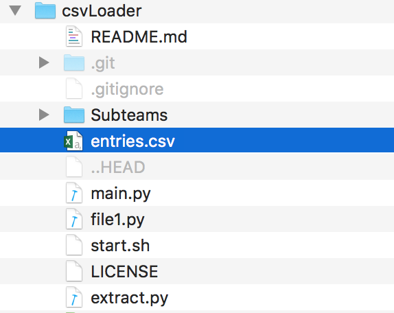
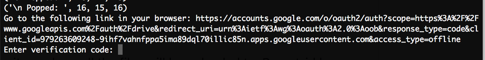

# CSV Loader
Bash Script to help automate and sort CSV entries into Google Drive.

# Prerequisites

Python >2.7 must be installed on the system to function. You must also have permission to run bash scripts

# Installation

### Clone or download the git repo
```
$ git clone https://github.com/EdwaRen/csvLoader
$ cd csvLoader
```

### Install python packages
```
$ pip install --upgrade google-api-python-client
$ pip install numpy tqdm requests
```

### Authorize bash for start.sh
```
$ chmod u+x start.sh
```

### Put entries.csv into the repository

The entries should be manually downloaded from a website, ie WordPress, Gravity Forms etc. Rename it entries.csv and place it within the repository. Your repo should look something like this:

<p align="left">
  
</p>

(In the image above, Subteams/ and file1.py should not visible unless you have already completed the next step)


### Run
```
$ ./start.sh
```

### Authorize

If you have not changed the parent_id in main.py, you will need to be authorized to modify the default applicants folder. Simply check your Terminal output a few seconds after doing $ ./start.sh:

<p align="left">
  
</p>

Go to this link and access with a verified account, then paste the verification code.

Now the uploading begins!

# Uploading

In main.py, if you are not uploading to WATO's private folder you will need to change parent_id to something else, for example:

```
parent_id = "ISUKJDJASN452DASYUDGHAND-DFS4"
```

# Known Issues

If the python script extract.py crashes on the line
```
for row in readCSV:
```
Then this means the csv file 'entries.csv' in the repo needs to be processed beforehand. This can be done simply by opening entries.csv in Excel, and saving as "Windows Comma Separated (csv)" rather than the default csv.

# Contact

eddie.ren.2013@gmail.com
